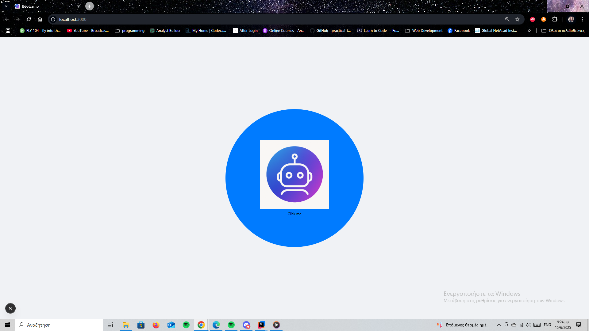

# Java Spring Bootcamp 2025

This is a repository for the final project of the Spring Bootcamp

# Getting Started

To use this code you need to:
- Intall IntelliJ or any other IDE
- Clone this repository
- Open the project in your IDE
- Install Java 21 and above
- Run the project

### Run the project
1. you must set the database from the (1_bootcamp_schema.sql)
2. run the Spring boot Application
3. run the React application in (cd frontend) from terminal with the (npn run dev)

# Project Features

This is a clone of an AI agent that you can chat with!

First you must click the button to login in the app

then you must Log in or create an account!

Log in

Create account

Once you have logged in, you can start chatting.

You can manage your information from the up right corner with the setting button

When you log out, the chat is erased.
